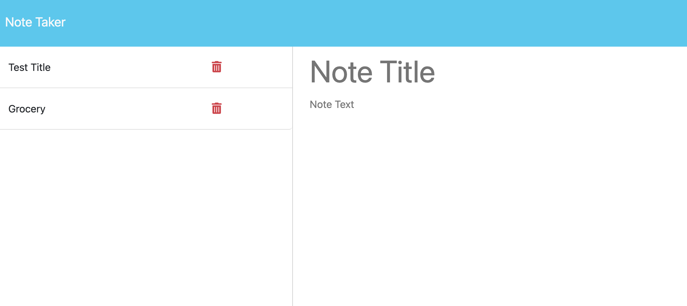

# Note Taker

This project has three parts

1. Introduction
2. Problem
3. Solution

## Introduction

This project was to modify starter code to create an application called Note Taker that can be used to write and save notes. This application will use an Express.js back end and will save and retrieve note data from a JSON file.

The application’s front end was created. The main task was to build the back end, connect the two, and then deploy the entire application to Heroku.

## Problem

Heroku as a deployment site was introduced and learn to deploy in a new site was bit challenging and to connect the front to the back end was quite a challenging for me this time. After a couple of failures i was able to do connect both successfully.

## Solution

With the help of solution learned in the class i was able to meet the acceptance criteria given below.

GIVEN a note-taking application

WHEN I open the Note Taker

THEN I am presented with a landing page with a link to a notes page

WHEN I click on the link to the notes page

THEN I am presented with a page with existing notes listed in the left-hand column, plus empty fields to enter a new note title and the note’s text in the right-hand column

WHEN I enter a new note title and the note’s text

THEN a "Save Note" button and a "Clear Form" button appear in the navigation at the top of the page

WHEN I click on the Save button

THEN the new note I have entered is saved and appears in the left-hand column with the other existing notes and the buttons in the navigation disappear

WHEN I click on an existing note in the list in the left-hand column

THEN that note appears in the right-hand column and a "New Note" button appears in the navigation

WHEN I click on the "New Note" button in the navigation at the top of the page

THEN I am presented with empty fields to enter a new note title and the note’s text in the right-hand column and the button disappears

## Mock-Up

Deployed Heroku url :

https://thawing-brushlands-29538-a3063882980d.herokuapp.com/

## Credits
John Young ( Instructor )
Nick Gambino ( TA)

